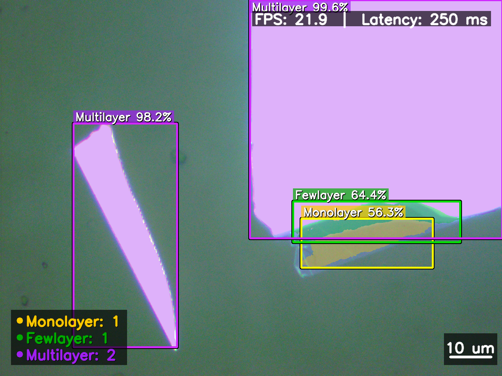

# 2DMatScope

2DMatScope 是一个面向二维材料显微图像的实时识别系统，覆盖显微相机采集、图像增强、轻量级语义分割、结果可视化、图片保存与视频录制等完整流程。项目使用 RepELA-Net 对 MoS2 显微图像进行像素级分类，区分背景、单层、少层和多层区域，并在桌面端将分割结果转换为连通区域、检测框、置信度和数量统计。

> RepELA-Net 是语义分割模型，不是目标检测模型。界面中的检测框由分割 mask 的连通域后处理生成。



## 主要功能

- 通过 Toupcam/Nncam SDK 枚举并控制显微相机。
- 支持分辨率切换、曝光、增益、白平衡及 ROI 调节。
- 提供锐化、Gamma 和 CLAHE 等实时图像增强能力。
- 使用 RepELA-Net 完成 4 类二维材料语义分割。
- 使用 512 x 512 滑动窗口处理高分辨率图像，并对重叠区域进行概率融合。
- 通过独立推理线程处理最新帧，降低模型计算对界面刷新的阻塞。
- 支持时序平滑、置信度过滤、类别筛选和连通区域统计。
- 同时显示原始画面和推理结果，并展示 FPS 与推理延迟。
- 支持截图、结果导出及原始/检测双路 AVI 录制。
- 包含训练、评估、基线对比、消融实验和迁移学习代码。

## 模型结构

RepELA-Net 是为二维材料显微图像设计的轻量级分割网络，主要由以下模块组成：

| 模块 | 作用 |
| --- | --- |
| ZeroPadChannel / CSE | 保持 4 通道输入结构；可选使用 HSV 饱和度增强颜色差异 |
| Stem | 初始降采样和浅层特征提取 |
| RepConv Stage | 提取局部颜色、纹理和边缘信息，部署时可融合为单分支卷积 |
| ELA Stage | 在低分辨率特征上进行轻量级全局上下文建模 |
| DW-MFF Decoder | 动态融合多尺度特征并增强材料区域边界 |

模型输出 4 类像素级 logits：

| 类别 ID | 类别 |
| --- | --- |
| 0 | Background |
| 1 | Monolayer |
| 2 | Fewlayer |
| 3 | Multilayer |

## 项目结构

```text
2DMatScope/
|-- camera_ui/                 # PyQt5 界面、相机控制和实时推理
|-- RepELA-Net/
|   |-- datasets/              # MoS2 数据集加载与增强
|   |-- models/                # RepELA-Net 网络结构
|   |-- tools/                 # 训练、评估和实验入口
|   |-- scripts/               # 数据处理、可视化和分析脚本
|   |-- transfer/              # 迁移学习代码
|   `-- splits/                # 固定 train/val/test 划分
|-- drivers/                   # Windows 相机驱动
|-- nncamsdk.20171211/         # Toupcam/Nncam SDK
|-- docs/                      # 架构、训练流程和代码讲解文档
|-- recordings/                # Git LFS 管理的演示视频
|-- testoutput_pics/           # 推理结果示例
|-- detection_gui.py           # 桌面端启动入口
|-- best_model.pth             # 训练 checkpoint
`-- deploy_model.pth           # RepConv 融合后的部署权重
```

## 环境要求

桌面端相机功能面向 Windows 开发和测试。模型训练与离线评估可在支持 PyTorch 的其他系统上运行。

- Python 3.9-3.11
- PyTorch、TorchVision
- PyQt5
- OpenCV
- NumPy、Pillow、Matplotlib
- TensorBoard
- CUDA GPU（推荐，CPU 也可运行但速度较慢）
- Git LFS（下载仓库中的 AVI 文件时需要）

创建环境并安装基础依赖：

```powershell
conda create -n 2dmatscope python=3.10 -y
conda activate 2dmatscope

pip install torch torchvision
pip install pyqt5 opencv-python numpy pillow matplotlib tensorboard
```

训练基线模型时还需要：

```powershell
pip install segmentation-models-pytorch
```

请根据本机 CUDA 版本，从 [PyTorch 官方安装页面](https://pytorch.org/get-started/locally/) 选择匹配的 PyTorch 安装命令。

## 获取项目

仓库中的录制视频使用 Git LFS 管理。首次克隆前请确保已经安装 Git LFS：

```powershell
git lfs install
git clone https://github.com/JustinKe02/2DMatScope.git
cd 2DMatScope
git lfs pull
```

如果只需要代码和模型，可以正常克隆；未拉取 LFS 对象时，录制视频将保留为指针文件。

## 启动桌面端

1. 在 64 位 Windows 上安装 `drivers/x64/` 中的相机驱动。
2. 连接兼容 Toupcam/Nncam SDK 的显微相机。
3. 在仓库根目录启动界面：

```powershell
python detection_gui.py
```

进入界面后：

1. 打开相机并选择分辨率。
2. 点击 `Load Model`，选择根目录下的 `deploy_model.pth` 或 `best_model.pth`。
3. 确认模型变体为 `small`。
4. 启动检测，根据需要调整推理模式、类别显示和图像增强参数。

`deploy_model.pth` 已完成 RepConv 结构融合，更适合实时部署；`best_model.pth` 保留训练 checkpoint 信息。

## 数据集格式

训练数据默认不包含在仓库中。请将数据放置在 `RepELA-Net/Mos2_data/`，目录结构如下：

```text
Mos2_data/
|-- ori/
|   `-- MoS2/
|       |-- sample_001.jpg
|       `-- ...
`-- mask/
    |-- sample_001.png
    `-- ...
```

图像和 mask 使用相同文件名；mask 像素值必须为 `0-3` 的类别 ID。

生成固定数据划分：

```powershell
cd RepELA-Net
python scripts/generate_splits.py --data_root Mos2_data --output splits/
```

默认划分比例为 70% 训练集、15% 验证集和 15% 测试集，随机种子为 42。

## 训练

在 `RepELA-Net` 目录中运行：

```powershell
# 训练 RepELA-Small
python tools/train.py --model repela_small

# 使用 AMP 和 EMA
python tools/train.py --model repela_small --amp --ema

# 从 checkpoint 恢复
python tools/train.py --model repela_small --resume output/path/to/checkpoint.pth

# 训练全部基线
python tools/train.py --model all_baselines

# 运行全部消融实验
python tools/train.py --model repela_small --ablation all
```

默认训练配置包括 512 像素裁剪、AdamW、warmup cosine 学习率、Focal + Dice 损失以及滑动窗口验证。训练结果写入 `output/`，其中包括日志、TensorBoard 记录、最佳 checkpoint 和部署权重。

## 评估

```powershell
cd RepELA-Net
python tools/eval.py `
  --model repela_small `
  --split test `
  --checkpoint output/path/to/best_model.pth `
  --output output/eval_test
```

评估脚本计算 mIoU、各类别 IoU、F1、像素准确率和混淆矩阵，并支持滑动窗口与 TTA。

## 详细文档

- [架构审计](docs/architecture_audit.md)
- [模型训练、调参与选型流程](docs/model_training_and_selection_pipeline.md)
- [相机链路逐段讲解](docs/beginner_line_by_line_camera_chain.md)
- [实时推理策略逐段讲解](docs/beginner_line_by_line_inference_strategy.md)
- [项目面试速记版](docs/2dmatscope_interview_crash_course.md)

## 注意事项

- 数据集以及 `RepELA-Net` 下的训练输出和新增模型权重默认由 `.gitignore` 排除，请根据实际需要管理实验产物。
- AVI 演示视频由 Git LFS 管理，提交新视频前请确认 Git LFS 已启用。
- 推理速度取决于 GPU、输入分辨率、滑窗数量和可视化设置。
- 相机驱动和 SDK 位数必须与 Python 解释器一致，推荐统一使用 64 位环境。
- 仓库目前未附带开源许可证，代码的复制、分发和商业使用需获得仓库所有者许可。
