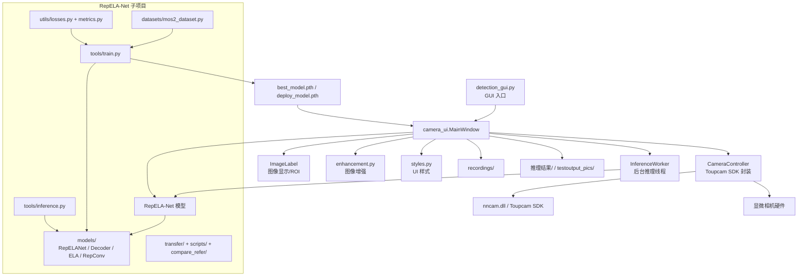
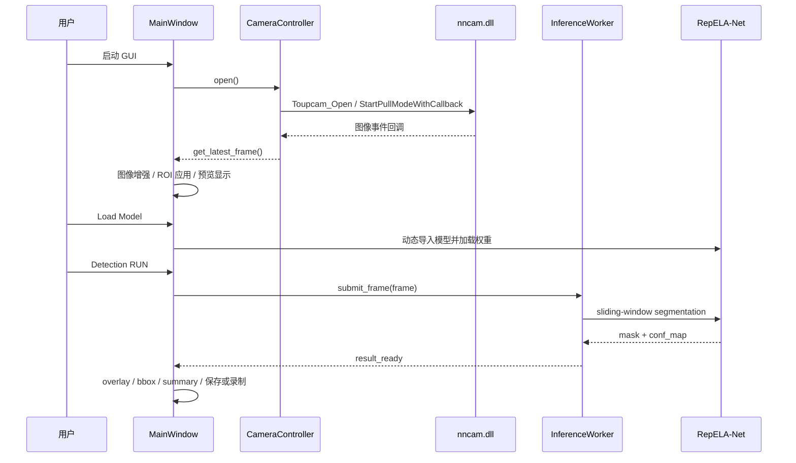
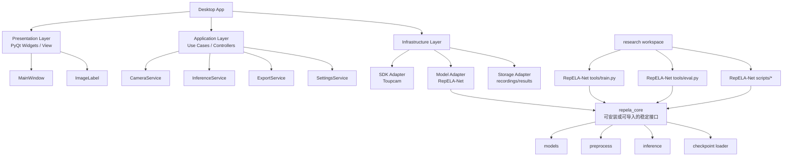

# 2DMatScope 架构审计

## 1. 项目定位

这个仓库实际上由两套系统并置组成：

1. `camera_ui/` + `detection_gui.py`
   面向本地显微相机的桌面实时检测 GUI。
2. `RepELA-Net/`
   面向 2D 材料语义分割的训练、评估、可视化研究子项目。

当前不是严格的一体化分层工程，而是“应用层直接嵌入研究模型仓库”的组合式结构。

## 2. 当前架构总览

## 3. 运行时链路

## 4. 模块职责

| 模块 | 职责 | 结论 |
| --- | --- | --- |
| `detection_gui.py` | 应用入口 | 简单清晰 |
| `camera_ui/main_window.py` | UI、状态管理、相机控制、模型加载、推理调度、导出、录制 | 职责过重，是当前架构核心瓶颈 |
| `camera_ui/camera_controller.py` | Toupcam SDK 封装、抓帧线程、曝光/白平衡/ROI 控制 | 拆分较合理 |
| `camera_ui/inference_engine.py` | 后台推理、滑窗推理、结果可视化 overlay | 思路正确，但与 `RepELA-Net/tools/*.py` 存在逻辑重复 |
| `camera_ui/image_label.py` | 图像显示、ROI 交互 | 内聚度较好 |
| `RepELA-Net/models/` | 模型结构定义 | 分层清楚 |
| `RepELA-Net/datasets/` | 数据读取和增强 | 清楚，偏研究代码风格 |
| `RepELA-Net/tools/` | 训练、评估、推理、benchmark | 能用，但依赖相对路径和 `sys.path` 注入 |

## 5. 审计结论

### 优点

- 实时链路是通的：相机抓帧线程与推理线程分离，UI 不直接阻塞。
- 模型研究部分在 `RepELA-Net/` 内相对完整，包含训练、评估、迁移学习和可视化工具。
- 数据层、损失函数、指标函数相对独立，便于继续做实验。
- GUI 推理线程采用“最新帧覆盖旧帧”策略，符合实时场景的低延迟需求。

### 主要问题

1. `MainWindow` 是明显的 God Object。
   一个文件同时处理界面、设备、模型、推理、可视化、导出和配置持久化。

2. GUI 与 `RepELA-Net` 是源码级硬耦合。
   GUI 通过运行时修改 `sys.path` 直接加载 `RepELA-Net/models`，而不是通过稳定的服务层或包接口。

3. 滑窗推理逻辑重复。
   GUI 的 `InferenceWorker`、训练脚本、推理脚本都各自维护一份 sliding-window 逻辑，后续参数漂移风险高。

4. 项目根目录混入了大量运行产物。
   权重、截图、录像、推理结果都和源码并列，源码边界不清晰。

5. 工程化基础薄弱。
   根目录没有标准依赖清单，部署与复现依赖隐式环境。

6. 路径和环境假设偏强。
   SDK 和测试脚本中存在本机绝对路径兼容逻辑，移植性一般。

## 6. 关键证据

- GUI 入口直接进入 `camera_ui.main`: `detection_gui.py`
- `MainWindow` 初始化时集中持有相机、模型、推理、录制、导出状态：`camera_ui/main_window.py`
- 实时主循环同时负责显示、ROI、推理提交和录制：`camera_ui/main_window.py`
- 模型加载阶段通过 `sys.path` 注入 `RepELA-Net`，并依赖 UI 当前选中的模型变体：`camera_ui/main_window.py`
- SDK 通过 `camera_ui/sdk_types.py` 自动搜 DLL，并保留本机历史绝对路径回退
- 推理线程内部自带滑窗预测：`camera_ui/inference_engine.py`
- 训练脚本和数据脚本具备独立研究流水线：`RepELA-Net/tools/train.py`、`RepELA-Net/datasets/mos2_dataset.py`

## 7. 建议的目标架构

## 8. 推荐拆分顺序

1. 先把 `main_window.py` 拆成 4 个服务：
   `camera_service.py`、`model_service.py`、`export_service.py`、`settings_service.py`

2. 把滑窗推理和 checkpoint 加载抽成统一模块：
   例如 `RepELA-Net/inference_api.py` 或单独的 `repela_core/`

3. 让 GUI 不再直接拼接 `sys.path`；
   改为导入稳定接口，如 `from repela_core import load_model, predict_fullres`

4. 将运行产物迁移到统一输出目录：
   例如 `artifacts/weights/`、`artifacts/runs/`、`artifacts/exports/`

5. 增加环境文件：
   `requirements.txt` 或 `environment.yml`

## 9. 一句话判断

这是一个“功能已经打通、研究代码充足，但应用层与研究层尚未解耦”的项目。  
如果目标是论文实验，它已经够用；如果目标是长期维护或交付软件，下一步必须先做分层和接口收敛。
