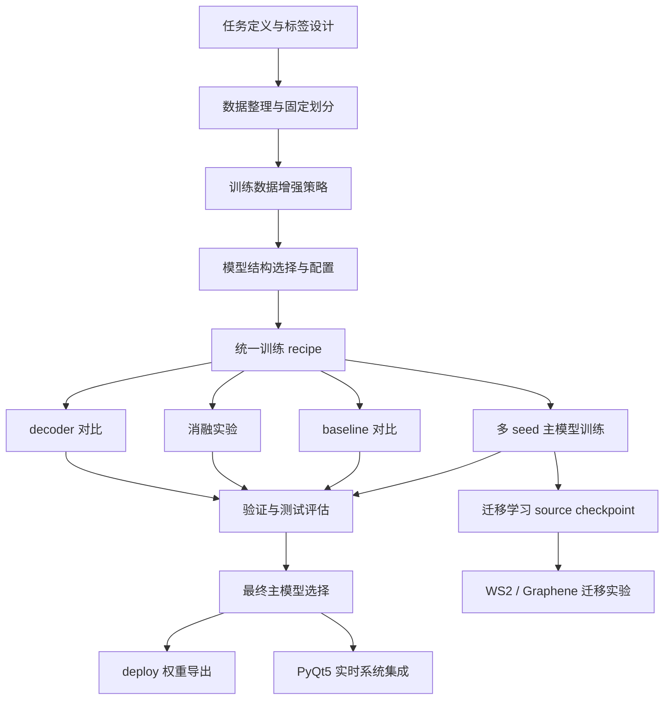

# 2DMatScope 模型训练、模型设置、调参与最终选型全流程

## 1. 文档目的

这份文档专门说明 `2DMatScope` / `RepELA-Net` 项目中，模型是如何从数据准备一路走到最终选型和部署的。重点回答 4 个问题：

1. 这个项目训练的到底是什么模型，任务边界是什么。
2. 训练时有哪些关键设置，为什么这样设。
3. 调参、消融、baseline 对比和迁移实验是怎么组织的。
4. 最终为什么选择当前这版模型，以及不同实验里为什么会出现 `seed_123` 和 `seed_42` 两个不同的 checkpoint。

这不是泛泛而谈的深度学习流程，而是严格对应当前仓库真实代码和实验结果的项目文档。

---

## 2. 先说结论：这不是 YOLO 检测训练流程

这个项目的底层任务不是目标检测，而是**二维材料显微图像语义分割**。

- 输入：显微镜/显微相机采集的二维材料图像
- 输出：每个像素属于哪一类
- 类别：`background / monolayer / fewlayer / multilayer`

之所以不用 YOLO 一类检测模型，是因为二维材料的单层、少层、多层区域通常：

- 形状不规则
- 边界细且模糊
- 同一片材料内部可能存在多种层数分区

如果只输出一个框，很难准确表达层数区域；而语义分割可以直接给出像素级结果。GUI 里看到的检测框和置信度，是在分割 mask 基础上做连通域后处理得到的展示形式，不是模型直接输出。

---

## 3. 整体流程总览



如果面试时只能讲一句话，可以概括成：

> 我先把二维材料层数识别定义成 4 类语义分割问题，再固定数据划分和统一训练 recipe，在这个基础上做主模型、多 seed、baseline、消融和迁移实验，最后从精度、轻量化和系统集成三个维度一起选出最终模型。

---

## 4. 阶段一：任务定义与标签设计

### 4.1 任务定义

这个项目面向的是二维材料显微图像中的层数识别，核心任务是判断像素属于：

- `0`: background
- `1`: monolayer
- `2`: fewlayer
- `3`: multilayer

对应代码：

- 数据集定义：[RepELA-Net/datasets/mos2_dataset.py](F:/Code/Windows_train/2DMatScope/RepELA-Net/datasets/mos2_dataset.py:18)
- 类别名与类别权重：[RepELA-Net/datasets/mos2_dataset.py](F:/Code/Windows_train/2DMatScope/RepELA-Net/datasets/mos2_dataset.py:38)

### 4.2 为什么这是 4 类分割而不是 3 类或检测

因为在 MoS2 主数据集里，背景、单层、少层、多层是明确分开的四个类别。这样定义的好处是：

- 对材料表征更有解释性
- 后续可以单独统计单层和少层
- 更适合做迁移学习中的类映射分析

Graphene 等数据集在迁移学习里可能是 3 类，但主线 source 任务是 4 类 MoS2 分割。

---

## 5. 阶段二：数据整理与固定划分

### 5.1 数据组织方式

MoS2 数据集使用固定目录结构：

```text
data_root/
├── ori/MoS2/   # 原图 jpg
├── mask/       # mask png，像素值 0-3
└── splits/     # train.txt / val.txt / test.txt
```

对应代码：

- 数据集加载器：[RepELA-Net/datasets/mos2_dataset.py](F:/Code/Windows_train/2DMatScope/RepELA-Net/datasets/mos2_dataset.py:18)

### 5.2 为什么要固定 split

这个项目不是随手随机划分，而是使用固定的 `train / val / test` 文本文件。这样做有两个目的：

1. 保证所有模型、消融和 baseline 在同一套数据划分上比较。
2. 避免每次随机切分导致结果漂移，方便复现和论文写作。

### 5.3 训练集、验证集、测试集扮演什么角色

- `train`：用于真正更新模型参数
- `val`：用于训练过程中的 early stopping 和 best checkpoint 选择
- `test`：只在训练完成后做正式评估，不参与调参

这里一定要强调：**best_model.pth 的选择依据是验证集 mIoU，不是测试集 mIoU。**

---

## 6. 阶段三：数据增强与样本不均衡处理

### 6.1 为什么要做增强

二维材料数据有两个明显问题：

1. 数据量不大
2. 单层和少层像素占比很低，背景像素占比很高

当前项目记录的类别分布大致为：

- background: `74.86%`
- monolayer: `3.12%`
- fewlayer: `2.46%`
- multilayer: `19.56%`

对应代码：

- 类别权重与注释：[RepELA-Net/datasets/mos2_dataset.py](F:/Code/Windows_train/2DMatScope/RepELA-Net/datasets/mos2_dataset.py:38)
- 损失函数中的分布说明：[RepELA-Net/utils/losses.py](F:/Code/Windows_train/2DMatScope/RepELA-Net/utils/losses.py:8)

### 6.2 训练时用了哪些增强

训练数据增强主要包括：

- random crop 到 `512 x 512`
- 水平翻转
- 垂直翻转
- `0 / 90 / 180 / 270` 旋转
- brightness 调整
- contrast 调整
- saturation 调整
- gaussian blur

对应代码：

- 随机裁剪：[RepELA-Net/datasets/mos2_dataset.py](F:/Code/Windows_train/2DMatScope/RepELA-Net/datasets/mos2_dataset.py:89)
- 数据增强：[RepELA-Net/datasets/mos2_dataset.py](F:/Code/Windows_train/2DMatScope/RepELA-Net/datasets/mos2_dataset.py:114)

### 6.3 CopyPaste 为什么存在，但不是主线默认设置

项目中实现了针对少数类的 `CopyPaste` 增强，目的是提高单层和少层像素在 batch 中的出现频率。

对应代码：

- `CopyPaste` 实现：[RepELA-Net/datasets/mos2_dataset.py](F:/Code/Windows_train/2DMatScope/RepELA-Net/datasets/mos2_dataset.py:139)
- CLI 开关：[RepELA-Net/tools/train.py](F:/Code/Windows_train/2DMatScope/RepELA-Net/tools/train.py:162)

但主线 3-seed source 实验记录的是：

- `CopyPaste=False`

这样做的原因是：主模型基线要先稳定，再逐步引入额外增强项。否则如果一开始就把所有技巧叠满，很难判断性能变化到底来自模型本身还是数据增强。

---

## 7. 阶段四：模型结构设计与模型设置

### 7.1 主模型是什么

主模型是自研的 `RepELA-Net`，不是外部现成 YOLO、UNet 或 SegFormer 直接拿来部署。

模型主体位置：

- [RepELA-Net/models/repela_net.py](F:/Code/Windows_train/2DMatScope/RepELA-Net/models/repela_net.py:113)

### 7.2 核心结构

主模型可以拆成 4 个部分：

1. 输入增强/占位模块：`ColorSpaceEnhancement` 或 `ZeroPadChannel`
2. 编码器浅层：`RepConv Stage1/2`
3. 编码器深层：`ELA Stage3/4`
4. 解码器：`DW-MFF + Boundary Enhancement`

### 7.3 这些模块各自解决什么问题

#### RepConv

训练时用多分支提高表达能力，推理时通过重参数化把多分支融合成单分支卷积，减少部署开销。

对应代码：

- `RepConv` 使用位置：[RepELA-Net/models/repela_net.py](F:/Code/Windows_train/2DMatScope/RepELA-Net/models/repela_net.py:174)

#### ELA

在较低分辨率特征图上做轻量全局上下文建模，避免标准 Transformer 在高分辨率图像上计算过重。

对应代码：

- `ELA` 使用位置：[RepELA-Net/models/repela_net.py](F:/Code/Windows_train/2DMatScope/RepELA-Net/models/repela_net.py:185)

#### DW-MFF

动态融合多尺度特征，让网络自己决定浅层细节和深层语义的权重。

#### Boundary Enhancement

针对二维材料层间边界细、模糊的问题，增强边界相关信息。

对应代码：

- 解码器入口：[RepELA-Net/models/repela_net.py](F:/Code/Windows_train/2DMatScope/RepELA-Net/models/repela_net.py:198)

### 7.4 这个项目有哪些模型设置项

训练脚本里最重要的模型设置项有：

- `--model`: `repela_tiny / repela_small / repela_base / baseline`
- `--use_cse`: 是否启用颜色空间增强
- `--deep_supervision`: 是否启用辅助监督
- `--ablation`: 是否去掉某个模块

对应代码：

- 模型注册表：[RepELA-Net/tools/train.py](F:/Code/Windows_train/2DMatScope/RepELA-Net/tools/train.py:61)
- CLI 参数：[RepELA-Net/tools/train.py](F:/Code/Windows_train/2DMatScope/RepELA-Net/tools/train.py:123)

### 7.5 为什么主线选的是 RepELA-Small

从实验结果看，`RepELA-Small` 是轻量化和效果之间的折中点：

- 参数量约 `2.12M`
- 模型大小约 `8.28MB`
- `512 x 512` 输入 FLOPs 约 `5.28G`

它不是绝对精度最高，但在自研 scratch 训练条件下，已经兼顾了：

- 可解释的结构设计
- 明显更低的参数量和显存
- 可进一步部署到 GUI / 端侧的潜力

---

## 8. 阶段五：统一训练 recipe

### 8.1 为什么强调统一 recipe

当前项目里主模型、baseline、消融和 decoder compare，尽量使用统一训练框架。这样做是为了让对比更公平，避免出现：

- 有的模型训练 200 epoch
- 有的模型训练 80 epoch
- 有的模型用了预训练
- 有的模型没用预训练

统一训练入口：

- [RepELA-Net/tools/train.py](F:/Code/Windows_train/2DMatScope/RepELA-Net/tools/train.py:2)

### 8.2 主线训练配置

主线 3-seed source 训练记录的核心配置是：

- `epochs = 200`
- `batch_size = 8`
- `crop_size = 512`
- `lr = 6e-4`
- `min_lr = 1e-6`
- `warmup_epochs = 10`
- `weight_decay = 0.01`
- `val_stride = 384`
- `deep_supervision = False`
- `EMA = False`
- `CopyPaste = False`

对应代码：

- CLI 默认值：[RepELA-Net/tools/train.py](F:/Code/Windows_train/2DMatScope/RepELA-Net/tools/train.py:123)

### 8.3 优化器为什么选 AdamW

项目使用的是 `AdamW`：

- 对小数据视觉任务通常更稳
- 比传统 Adam 更清晰地处理 weight decay
- 在调学习率时更容易获得稳定收敛

对应代码：

- 优化器定义：[RepELA-Net/tools/train.py](F:/Code/Windows_train/2DMatScope/RepELA-Net/tools/train.py:568)

### 8.4 学习率为什么用 warmup cosine

训练使用 `warmup + cosine decay`：

- 前期 warmup 避免刚开始梯度太大导致训练不稳
- 后期 cosine 衰减让模型更平滑地收敛

对应代码：

- scheduler 定义：[RepELA-Net/tools/train.py](F:/Code/Windows_train/2DMatScope/RepELA-Net/tools/train.py:213)

### 8.5 为什么损失函数是 Focal + Dice

这是因为这个任务存在严重类别不均衡。

#### Focal Loss 作用

- 降低大量易分类背景像素的主导作用
- 让模型更关注难样本和少数类

#### Dice Loss 作用

- 直接优化区域重叠
- 比单纯 Pixel Accuracy 更适合分割任务

对应代码：

- `FocalLoss`：[RepELA-Net/utils/losses.py](F:/Code/Windows_train/2DMatScope/RepELA-Net/utils/losses.py:24)
- `DiceLoss`：[RepELA-Net/utils/losses.py](F:/Code/Windows_train/2DMatScope/RepELA-Net/utils/losses.py:90)
- `HybridLoss`：[RepELA-Net/utils/losses.py](F:/Code/Windows_train/2DMatScope/RepELA-Net/utils/losses.py:285)

### 8.6 Boundary Loss 为什么是可选项

边界损失是一个额外增强项，不是所有实验都默认开。主线先用 `Focal + Dice` 建立稳定基线，再决定是否额外加边界监督，这样更方便解释每个模块的真实贡献。

---

## 9. 阶段六：训练过程中的工程细节

### 9.1 固定随机种子

每次训练开始会固定：

- `random.seed`
- `numpy.seed`
- `torch.manual_seed`
- `torch.cuda.manual_seed`

这样做的目的是提高复现性。

对应代码：

- 随机种子设置：[RepELA-Net/tools/train.py](F:/Code/Windows_train/2DMatScope/RepELA-Net/tools/train.py:525)

### 9.2 AMP 和梯度裁剪

训练脚本支持 AMP 混合精度，并对梯度做 `clip_grad_norm_`，主要是为了：

- 提高训练效率
- 降低显存占用
- 防止梯度爆炸导致 NaN

对应代码：

- AMP 与梯度裁剪：[RepELA-Net/tools/train.py](F:/Code/Windows_train/2DMatScope/RepELA-Net/tools/train.py:383)

### 9.3 验证阶段为什么用整图/滑窗而不是训练 crop

训练时用随机裁剪，是为了高效训练和增强样本多样性。

验证时更接近真实部署场景，应该对**整张显微图**评估。当前训练脚本里：

- 默认先尝试 full image 预测
- 如果显存不够，再回退到滑窗推理

对应代码：

- 验证逻辑：[RepELA-Net/tools/train.py](F:/Code/Windows_train/2DMatScope/RepELA-Net/tools/train.py:448)
- 滑窗预测：[RepELA-Net/tools/train.py](F:/Code/Windows_train/2DMatScope/RepELA-Net/tools/train.py:286)

### 9.4 为什么滑窗是 `512` 和 `stride=384`

原因有三个：

1. 训练 crop 本身就是 `512`
2. 大图整图推理可能显存不稳定
3. `stride=384` 留出 `25%` 重叠，有助于减少窗口拼接缝

这套逻辑也被 GUI 推理线程复用：

- GUI 参数：[camera_ui/main_window.py](F:/Code/Windows_train/2DMatScope/camera_ui/main_window.py:71)
- GUI 滑窗实现：[camera_ui/inference_engine.py](F:/Code/Windows_train/2DMatScope/camera_ui/inference_engine.py:118)

---

## 10. 阶段七：指标体系与验证逻辑

### 10.1 为什么不能只看 Pixel Accuracy

因为背景像素太多，只看像素准确率很容易虚高。模型哪怕把大多数背景都分对了，单层和少层分错很多，Pixel Accuracy 依然可能看起来不错。

### 10.2 这个项目真正重点看哪些指标

- `mIoU`
- `per-class IoU`
- `mean F1`
- `Pixel Accuracy` 作为辅助参考

对应代码：

- 指标统计类：[RepELA-Net/utils/metrics.py](F:/Code/Windows_train/2DMatScope/RepELA-Net/utils/metrics.py:14)

### 10.3 为什么最佳模型按验证集 mIoU 保存

训练脚本里保存 `best_model.pth` 的条件是：

- 当前 `val mIoU` 超过历史最优

对应代码：

- best checkpoint 保存：[RepELA-Net/tools/train.py](F:/Code/Windows_train/2DMatScope/RepELA-Net/tools/train.py:646)

这样做符合标准机器学习流程，因为测试集不能参与训练期决策。

---

## 11. 阶段八：调参策略

### 11.1 这个项目不是“瞎试参数”，而是分层调参

建议把项目里的调参理解成 4 层：

1. **训练稳定性层**：学习率、warmup、weight decay、batch size、梯度裁剪
2. **输入尺度层**：crop size、val stride、是否滑窗
3. **结构层**：tiny/small/base、是否 use_cse、是否 deep supervision
4. **任务层**：是否 CopyPaste、是否边界损失、迁移学习时 reset head 还是 keep head

### 11.2 主线调参顺序

一个比较稳妥的实际顺序是：

1. 先固定数据划分和损失函数
2. 用 `RepELA-Small` 跑通基线
3. 调训练稳定性参数，让曲线不崩
4. 固定 recipe 后再做结构消融
5. 结构稳定后再做 baseline 公平对比
6. 最后再做迁移学习和补充数据实验

这背后的逻辑是：先保证实验“可比较”，再讨论模型“谁更好”。

### 11.3 为什么不同时改很多参数

如果同时改：

- 学习率
- 数据增强
- 模型结构
- 损失函数

最后即使指标提升了，也很难解释到底是谁起作用。对于论文、答辩和面试来说，这会让整个实验链条失去说服力。

---

## 12. 阶段九：多 seed、baseline、消融、decoder compare 各自扮演什么角色

### 12.1 多 seed 主模型训练

主模型使用了 3 个随机种子：

- `42`
- `123`
- `2026`

作用是回答一个关键问题：

> 这个模型的表现是稳定的，还是只是某一个 seed 运气好？

结果显示：

- `seed_123` 的测试结果最好：`84.64% mIoU`
- 3-seed 平均测试结果：`81.25 ± 3.3`

对应文档：

- 实验结果总表：[RepELA-Net/compare_refer/docs/experiment_results.md](F:/Code/Windows_train/2DMatScope/RepELA-Net/compare_refer/docs/experiment_results.md:11)

### 12.2 baseline 对比

baseline 的作用不是替代主模型，而是回答：

> 自研模型到底有没有合理性，放到统一框架下和常见结构比处在什么位置？

项目里对比了：

- FPN
- UNet
- DeepLabV3+
- PSPNet

有的 baseline 使用 ImageNet 预训练，有的也做了 scratch 公平对比。

对应文档：

- baseline 对比：[RepELA-Net/compare_refer/docs/model_comparison.md](F:/Code/Windows_train/2DMatScope/RepELA-Net/compare_refer/docs/model_comparison.md:7)

### 12.3 消融实验

消融实验回答的问题是：

> RepELA-Net 里的每个模块到底有没有必要？

当前主要做了：

- `w/o RepConv`
- `w/o ELA`
- `w/o BoundaryEnhancement`
- `w/o DW-MFF`

它们都是**独立从头训练**，不是在主模型上继续 fine-tune。

对应文档：

- 实验谱系说明：[RepELA-Net/explain/experiment_lineage.md](F:/Code/Windows_train/2DMatScope/RepELA-Net/explain/experiment_lineage.md:68)

### 12.4 decoder compare

decoder compare 不是迁移学习，而是固定 encoder 后，仅替换 decoder 比较不同多尺度融合设计的效果和效率。

这个实验回答的是：

> 当前自研 decoder 是否值得保留？

---

## 13. 阶段十：最终模型是怎么选出来的

这部分最容易在面试里讲混，所以单独说明。

### 13.1 “训练期最佳模型”和“项目最终展示模型”不是同一个概念

需要区分两个层次：

#### 层次 A：单次训练内部的 best checkpoint

在每次训练 run 中，`best_model.pth` 是根据**验证集 mIoU** 自动保存的。

#### 层次 B：整个项目最终采用哪个 run 作为主模型

这是训练结束后，基于多次实验的综合选择，包括：

- test mIoU
- mean F1
- per-class IoU
- 轻量化指标
- 与 GUI 集成的稳定性

### 13.2 为什么最终主模型展示常用 `seed_123`

因为在 3-seed 主模型结果中：

- `seed_123` 的 test mIoU 最好：`84.64%`
- Pixel Acc 最好：`98.08%`
- Mean F1 最好：`91.16%`

所以如果要向外展示一版“代表性最佳模型”，最自然的是用 `seed_123`。

对应文档：

- 主结果：[RepELA-Net/compare_refer/docs/experiment_results.md](F:/Code/Windows_train/2DMatScope/RepELA-Net/compare_refer/docs/experiment_results.md:11)

### 13.3 为什么迁移学习固定用 `seed_42`

迁移学习实验里统一使用 `seed_42` 作为 source checkpoint，不是因为它 test 最好，而是因为：

- 它可以被解释为 source 侧按验证表现选出的 canonical checkpoint
- 所有目标域都用同一个 source，实验更公平

也就是说：

- `seed_123` 更适合做主模型展示
- `seed_42` 更适合做统一迁移 source

对应文档：

- 谱系说明：[RepELA-Net/explain/experiment_lineage.md](F:/Code/Windows_train/2DMatScope/RepELA-Net/explain/experiment_lineage.md:103)
- 迁移结果：[RepELA-Net/compare_refer/docs/transfer_results.md](F:/Code/Windows_train/2DMatScope/RepELA-Net/compare_refer/docs/transfer_results.md:1)

### 13.4 最终模型选择时真正看的维度

项目里最终选模型不是单看一个数字，而是一起看：

1. `val mIoU` 是否稳定
2. `test mIoU` 是否代表当前最好水平
3. `monolayer / fewlayer` 这些少数类是否真的提升
4. 参数量、模型大小和显存是否足够轻量
5. 能否顺利导出 deploy 权重并接入 GUI 实时推理

这是一个“算法效果 + 工程可用性”的综合选型，不是纯学术排行榜式选型。

---

## 14. 阶段十一：从训练模型到部署模型

### 14.1 为什么训练权重和部署权重不是同一个文件

对于 RepELA-Net 来说，训练时 `RepConv` 是多分支结构；部署时希望把多分支融合成单分支卷积，降低推理开销。

因此训练结束后会额外导出：

- `best_model.pth`：训练/恢复/分析用 checkpoint
- `deploy_model.pth`：部署/GUI 加载用融合后权重

对应代码：

- deploy 导出：[RepELA-Net/tools/train.py](F:/Code/Windows_train/2DMatScope/RepELA-Net/tools/train.py:680)
- `switch_to_deploy`：[RepELA-Net/models/repela_net.py](F:/Code/Windows_train/2DMatScope/RepELA-Net/models/repela_net.py:257)

### 14.2 GUI 集成时还做了哪些工程化处理

模型进入 GUI 后，又加了几层实时系统逻辑：

- `512 x 512` 滑窗推理
- `stride=384` 重叠平均
- `EMA=0.3` 时序平滑
- `conf_threshold=0.4` 低置信度过滤
- latest-frame 策略降低延迟

对应代码：

- 推理线程：[camera_ui/inference_engine.py](F:/Code/Windows_train/2DMatScope/camera_ui/inference_engine.py:22)
- `EMA=0.3`：[camera_ui/inference_engine.py](F:/Code/Windows_train/2DMatScope/camera_ui/inference_engine.py:47)
- `conf_threshold=0.4`：[camera_ui/inference_engine.py](F:/Code/Windows_train/2DMatScope/camera_ui/inference_engine.py:49)

这一步说明项目不是“训练完就结束”，而是把训练模型接进了真实实时系统。

---

## 15. 如果把整个流程压缩成面试回答

可以直接这样讲：

> 这个项目的训练流程不是简单跑一个模型，而是先把二维材料层数识别定义成 4 类语义分割任务，然后固定 train/val/test 划分，用 512 裁剪和基础增强建立训练集，主线模型选自研 RepELA-Net，并用统一 recipe 训练，包括 AdamW、warmup cosine、Focal+Dice 和验证滑窗。之后我做了 3-seed 主模型、baseline 对比、模块消融和 decoder compare，确认模型结构的有效性。最终主模型展示通常用 test 最优的 seed_123，而迁移学习统一固定用 seed_42 作为 source checkpoint。训练完成后再把 RepConv 融合成 deploy 权重，接入 PyQt5 实时系统，用滑窗、EMA 和置信度过滤实现稳定推理。整个流程里，模型选择不是只看一个 mIoU，而是同时看精度、少数类表现、轻量化和工程可部署性。 

---

## 16. 一句话总结

这个项目的完整流程可以概括为：

> 先用固定数据划分和统一训练 recipe 建立可比较的基线，再围绕自研 RepELA-Net 做主模型、多 seed、消融、baseline 和迁移实验，最后从“效果、稳定性、轻量化、可部署性”四个维度共同确定最终模型，并导出 deploy 权重接入实时系统。
